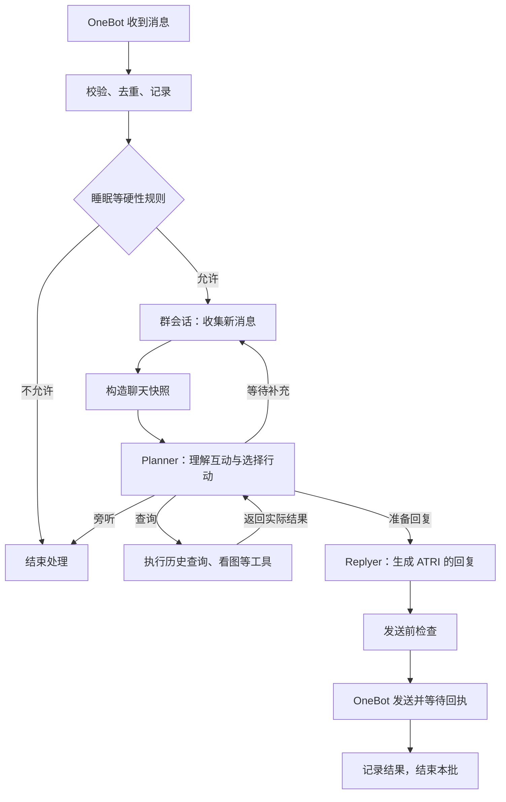

# ATRI 聊天机器人设计

一个有亚托莉性格的 QQ 群聊机器人。使用 Python，通过 NapCat / OneBot 11 连接 QQ；每个群有独立的 conversation，所有群面对的是同一个亚托莉。

## Everything is a plugin

消息总线负责调度，插件负责具体能力。主流程：

`接收与去重 → 按群排队 → 记录消息 → 观察插件 → 回复判断 → 构建上下文 → 模型与工具 → 输出加工 → 发送并记录`

- 使用 `asyncio`，同群串行、不同群并行；只有阻塞任务进入线程池。插件按启动配置中的阶段和顺序执行，不为每个插件常驻一个线程。
- 插件读取当前群的上下文快照，返回上下文补充、状态更新或后台任务，不直接修改共享对象。每个插件声明状态范围、超时和失败策略。
- 观察插件可在不回复时工作，例如收集表情及 description。耗时分析进入后台队列，不阻塞后续消息。
- 首版默认被 @、被回复或命中指定前缀时回应；主动参与群聊作为可配置扩展。忽略机器人自身消息，重连后按消息 ID 去重。

## Everything is a state machine

心情是**全局共享状态**，由 emotion 插件维护，例如情绪、强度、更新时间。它随互动变化，并逐渐回归平常状态；不同群的互动都可以影响它。

全局状态由统一管理器串行更新，每次生成回复使用一个确定的状态快照。模型请求期间不持有全局锁。跨群只共享心情等明确声明的状态，不把其他群的聊天内容带入当前群。

聊天历史、摘要和群设置按群隔离；人物关系按用户 ID 区分。状态持久化，重启后恢复。插件允许不提供模型上下文，例如仅保存表情素材。

## Everything is a tool

模型可选择的工具保持少量，例如使用现有语音、选择表情。工具返回结构化结果和待发送内容，由发送模块统一发送；不允许多个插件各自发送同一条回复。工具调用有超时和轮数上限。

裁剪、分段和文字润色属于固定输出插件，不暴露为模型工具。错别字、口癖等可配置，但默认不机械添加。发送记录区分待发送、成功和失败；结果不明时不盲目重发。

## Everything is a file

每个插件、工具对应一个目录：`plugins/<name>/`、`tools/<name>/`。启动配置决定启用项、插件顺序和参数。

数据优先使用可读文件：

- `data/groups/<group_id>/messages.jsonl`：完整消息记录，保留发送者、消息 ID、时间和消息片段；同群单写入者追加。
- `data/global/emotion.json`：全局心情；状态文件通过临时文件替换，避免写到一半损坏。
- `profile.md`、`data/corpus/`：当前人设卡与带来源的风格示例；原作设定库后续补充。
- `data/assets/`：表情、语音及其描述、来源索引；原始解包素材只读引用，不重复复制。

日志完整保存，但模型上下文有长度预算，只选取近期消息、摘要和相关记忆。Debug 模式保存实际上下文、状态快照、插件耗时和工具结果，隐藏密钥。

## 让回复像亚托莉

采用“固定人设 + 情境示例 + 当前心情”，首版先用提示词与检索，验证效果后再考虑微调。

- **固定人设**：机器人少女、好奇、自信于自己的高性能，热心但会犯迷糊；认真时能够温柔直接。说话偏短、有具体反应，不把每次回复写成长篇解释，也不句句追加“高性能”。
- **风格示例**：从亚托莉台词中提取带前后文的短对话，标注安慰、被夸、被调侃、好奇、道歉等情境和情绪。每轮选少量匹配当前互动的示例，让模型学习回应方式，结合当前聊天组织新回复。
- **原作设定**：单独整理身份、经历和人物关系，保留章节来源及剧透阶段。默认使用日常互动的人设；角色所处剧情阶段可配置。原作知识不视作 QQ 群里真实发生过的记忆，也不默认把群友当夏生或主人。
- **表达素材**：已有语音按台词、含义和情绪建立索引；只有与当前意图一致才使用。新生成的句子默认发文字，后续再接 TTS。表情同样按含义和情绪选择。

原作示例、检索资料和群消息都作为带来源的数据，不覆盖系统规则。用固定的群聊情境评测人设一致性、回应相关性、口癖重复和记忆混淆；测试集与检索示例分开。

素材处理和首版落地方案见 [角色方案](persona.md)。

当前已实现的能力、启动方式与待办见 [README](README.md)，不要将本设计中的后续能力视为已完成。

## 当前实现增量（2026-09）

### 活动、表情与工具边界

`activity` 是 group scope 的上下文插件：它从当前群消息更新“ATRI 当前正在做的事”，由框架持久化至当前群的插件状态文件，作为提示词中的参考数据。它不跨群共享，也不宣称真实执行了外部动作。

表情包使用独立 sticker 目录和审核索引；默认流水线不再自动追加 Unicode emoji。模型只能选择审核通过的资源 ID，发送层负责 OneBot 段校验。

联网搜索已作为显式只读工具接入模型适配层，详见下方工具落地规格。搜索结果以 `reference_data` 标识，不覆盖 system/persona。默认关闭，需配置 endpoint 与 allowed_hosts 后启用。

### 后续状态模型

群友 description、关系和好感度应使用按群隔离的 `members/<user_id>.json` 与 `relations.jsonl`，由 observe 阶段异步抽取候选，再经置信度阈值和时间衰减写入；模型上下文只注入摘要，不注入未经确认的敏感属性。RAG 先采用现有 `Corpus` 接口扩展为可替换 retriever，向量库和 conversation 持久化待确认后再选型。

## 工具落地规格（2026-09-05）

工具放在 `tools/<name>/tool.py` 与 `tool.toml`，复用本地模块加载器；工具是可信 Python，默认无启用项。`ToolRunner` 只执行启动时注册的名称，校验 JSON 对象参数，限制单轮最多 4 次调用、每次超时和结果大小。模型适配器保留 assistant/tool 调用链，达到轮数上限后要求最终文字，拒绝继续调用。工具失败返回有限错误码，模型应诚实说明失败，不能编造已搜索结果。调试记录保存本轮工具参数、结果和耗时，使用现有脱敏流程。

首个工具为 `web_search(query)`，使用 SearXNG 的 JSON `/search` 接口（[协议](https://docs.searxng.org/dev/search_api.html)）。`[search]` 配置固定 endpoint、allowed_hosts、timeout、max_response_bytes；只允许访问明确配置的主机，禁用重定向，不抓取结果 URL。远程 endpoint 使用 HTTPS，本机可使用 HTTP。搜索响应裁剪为最多 5 条标题、链接、摘要和查询时间；结果视作不可信参考数据。没有匹配结果与搜索失败分别返回。搜索会把查询发送至配置的服务。

验收分三层：本地 HTTP 协议及工具循环回归；配置好的真实模型/搜索服务离线于 QQ 的联调；固定群聊情境人工评估相关性、人设、口癖重复、事实与来源一致性。前两层成功不能替代第三层。尚无搜索 endpoint 时保持工具关闭，明确记录未完成真实搜索验收。

### 角色效果评测实现

`evaluations/scenarios.json` 保存 30 个新写的群聊场景及人工验收要点，不将其加入原作检索库。`atri evaluate` 对比关闭示例与当前示例检索两组真实模型结果，使用临时群日志与心情，不接入 QQ；逐条写入报告，记录失败以及简短性/口癖频率等诊断指标。指标只作为人工阅读线索，不自动宣布“拟人”或“像 ATRI”。模型版本、随机性和实际输出构成报告的一部分；明确区分真实模型与固定 demo。

群友 description、关系与好感度的具体状态、存储及验收见 [群友记忆设计](social-memory.md)。

### 插件状态与生命周期增量

插件可用 `stages = ["observe", "context", "delivered"]` 声明多个阶段，原有单 `stage` 继续有效。每次调用的 View 带 stage、当前时刻、插件独立 state 和可选投递 receipt；group 插件可返回 `Effect.state`，由 Pipeline 原子保存至本群 `plugins/<name>.json`。插件的 bind 钩子接收无工具的模型抽取服务，close 钩子负责结束其后台任务。所有实际消息仍只由 Bot 统一发送。

记忆插件的自述、候选、关系与好感度采用 [群友记忆设计](social-memory.md) 中的单群原子快照；插件输出的成员资料、关系和活动均放入 reference_data，不能拼为系统指令。总上下文超预算时先裁剪参考记忆，再按既有策略压缩旧消息与当前消息。

context 插件可对已完成的明确管理命令返回 `Effect.reply`，Bot 跳过主模型并统一投递该回执；普通聊天仍由模型生成。delivered 钩子失败只记录诊断，不能把已确认发送成功的消息回退为失败。

## 验收指标与迭代门槛

评测程序对每个回复记录确定性筛查指标：是否为空、是否控制在一至三句、是否超过 400 字、是否自然使用表情、是否重复“高性能”、是否出现“看到了图片/转账成功/坐在旁边”等越界断言。指标用于发现回归，不能替代人工审阅；人工需按场景检查回应当前消息、共情与实用性、角色语气、事实边界、群隔离和工具诚实性。只有在合成场景与人工抽样都稳定后，才扩大风格语料或启用 RAG。
